<p align="center">
  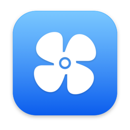
</p>

<h1 align="center">FanCurve</h1>

<p align="center">
  <strong>Custom fan curves for Apple Silicon Macs, plus the menu bar utilities you keep reaching for.</strong><br>
  Temperature-based fan control · external monitor brightness · a Raycast-style command palette · meetings · snippets · global mic mute
</p>

<p align="center">
  <a href="../../releases/latest"></a>
  <a href="../../actions/workflows/build.yml"></a>
  
  
  <a href="LICENSE"></a>
</p>

<p align="center">
  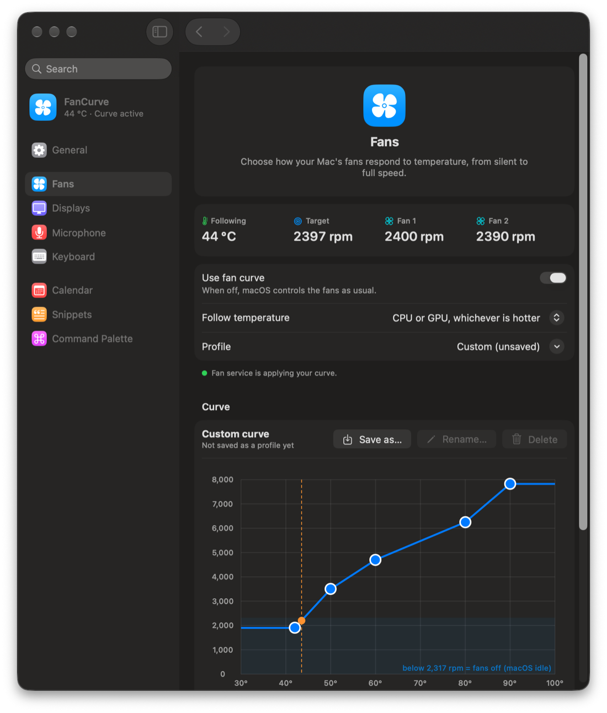
</p>

FanCurve is a native macOS menu bar app written in Swift and SwiftUI. Its core is fan control: you draw a temperature→RPM curve, and a small root service applies it to your MacBook's fans every two seconds. Around that sit the small utilities that usually take five separate apps. All of it is laid out like System Settings on macOS 26 and later.

## Contents

- [Features](#features)
- [Requirements](#requirements)
- [Installation](#installation)
- [Permissions](#permissions)
- [Keyboard shortcuts](#keyboard-shortcuts)
- [How it works](#how-it-works)
- [Updating](#updating)
- [Building from source](#building-from-source)
- [Safety](#safety)
- [FAQ](#faq)
- [Credits](#credits)
- [License](#license)

## Features

### Fan control

- **Drag-and-drop fan curve.** Drag points to shape it, double-click to add a point, right-click to remove one. A live marker shows where you are on the curve right now.
- **Follows the temperature you choose:** hottest CPU core, CPU average, GPU, or whichever of CPU and GPU is hotter. It reads the SMC's per-core sensors (73 CPU and 42 GPU sensors on an M5 Pro).
- **Noctua-based presets:** Quiet, Balanced and Performance, adapted from Noctua's published example curves for a laptop. Below the fans' minimum speed, macOS keeps them switched off, so your Mac stays silent when idle.
- **Your own profiles:** save the current curve by name, and switch profiles from the menu bar or the command palette.
- **Built to stay quiet and safe:**
  - **Smoothing** evens out the temperature so short spikes don't move the fans.
  - **Spin-up delay:** idle fans only start once the curve has asked for them for 15 s.
  - **Hysteresis:** fans stay on until the temperature is 3 °C below where they started, so they don't flick on and off.
  - **Max above a set temperature:** above it (95 °C by default) the fans always run flat out.
  - **Fails safe:** any error, quitting, or turning the curve off hands the fans straight back to macOS.

### Command palette (⌥Space)

<p align="center">
  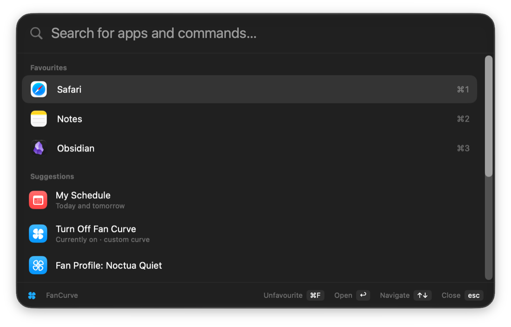
</p>

A Raycast-style glass search panel:

- **Favourite apps** listed first. Launch them with ⌘1–9 in the palette or ⌃⌥1–9 from anywhere. Press ⌘F to pin the selected app.
- **App launcher** with fuzzy search across `/Applications` and the system apps.
- **Calculator:** type `23*1.21`, and pressing Return copies the answer.
- **FanCurve commands:** turn the fan curve on or off, switch profiles, mute the mic, set external brightness, keyboard cleaning mode.
- **System commands:** lock screen, sleep, screen saver, toggle dark mode.
- **Quick Notes:** jot something down straight from the palette (see below).
- **Spotlight file search** inside the palette, useful when ⌘Space belongs to the palette.
- **[Obsidian](https://obsidian.md) integration**, like Raycast's Obsidian extension:
  - **Search notes** by title or by text, with a snippet showing the match.
  - **Capture to your daily note:** type a thought and choose *Append to Daily Note*. It works with any daily-note layout, which FanCurve detects from your existing notes.
  - **Create notes**, open today's daily note, open your vault, or open a random note.
- **[AeroSpace](https://github.com/nikitabobko/AeroSpace) integration** (optional, when AeroSpace is installed):
  - **Tiling and layouts:** toggle tiling, change layout, float, fullscreen, balance.
  - **Workspaces:** jump to one (each is listed with the apps in it), or move the focused window there.
  - **Windows:** focus any window.
  - **Sizes and layouts:** set the focused window to ½, ⅓, ¼, ⅔ or ¾ of the screen width. Presets: *Half + Two Quarters (stacked)* and *Half + Two Quarter Columns*.
  - **Settings:** gaps, start at login and default layout. These edit `~/.aerospace.toml` in place and reload AeroSpace.

<p align="center">
  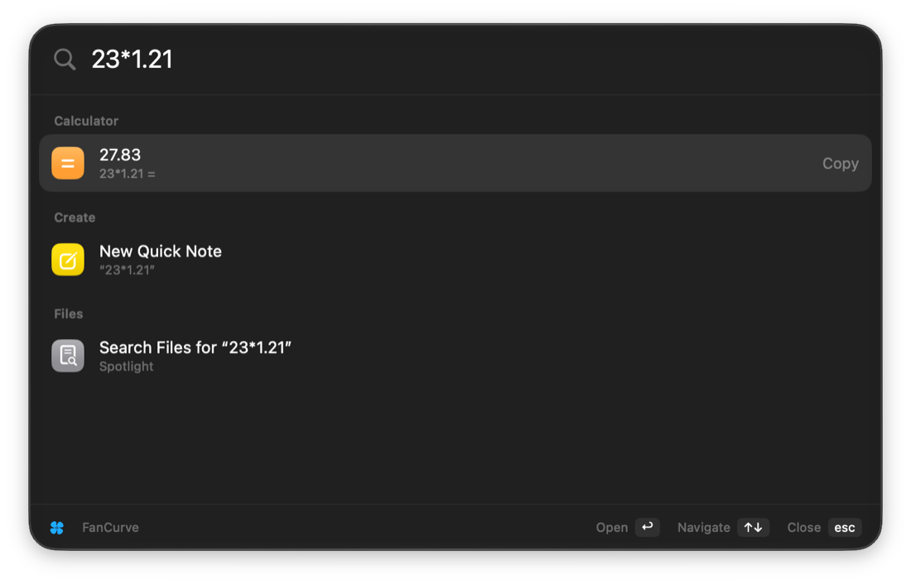
  &nbsp;
  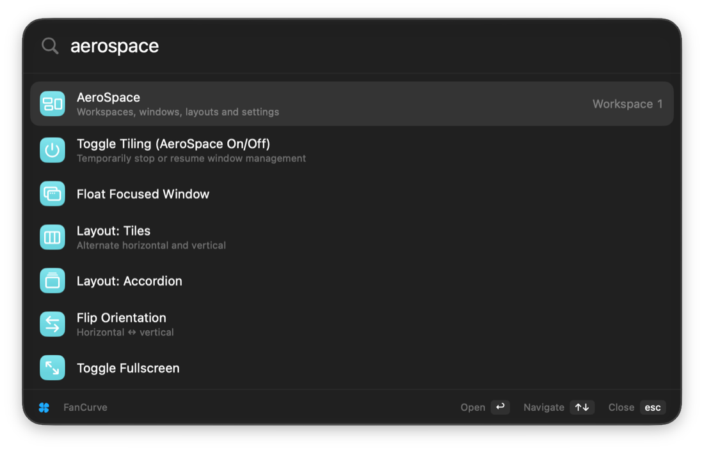
</p>

<p align="center">
  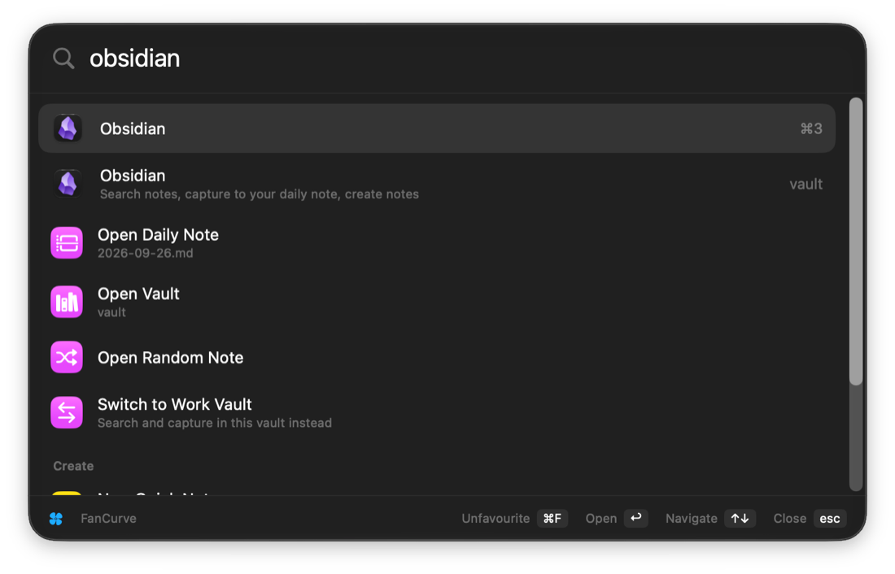
  &nbsp;
  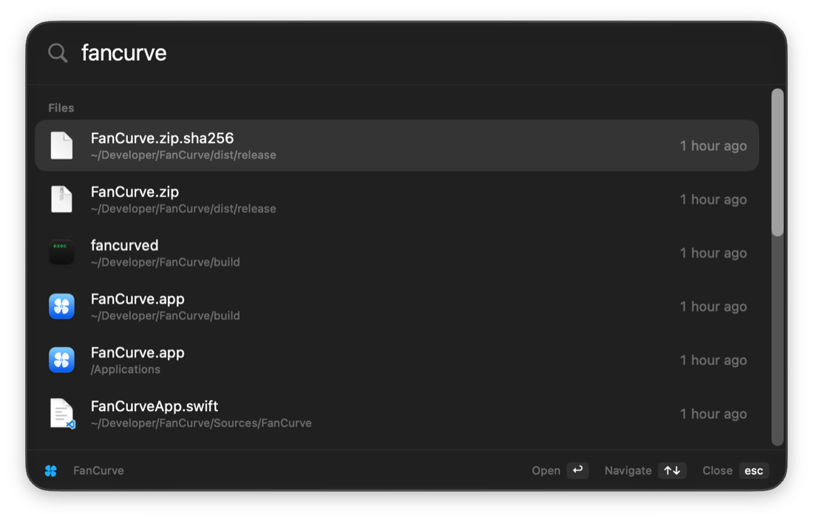
</p>

### Quick Notes (⌃⌥N)

<p align="center">
  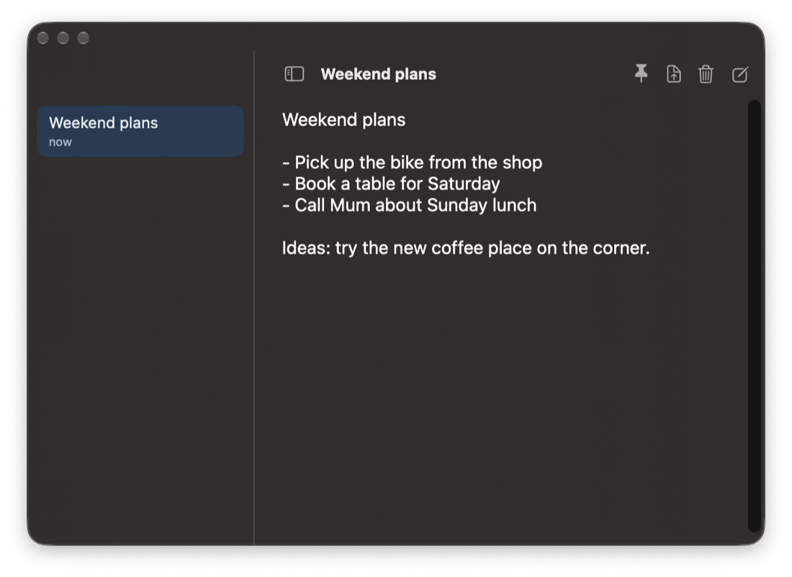
</p>

- **Floating scratchpad** like Raycast Notes: a note list beside a distraction-free editor, saved as you type, and optionally kept on top.
- **Create from the palette:** type anything and choose *New Quick Note*, or search your notes with *Search Quick Notes*.
- **Move to Obsidian:** one click moves a note into your vault's `Notes/` folder when it's worth keeping.

### Calendar and meetings

- **Next meeting in the menu bar**, e.g. *Standup · in 12 min*. It switches to a video icon when the meeting starts.
- **Join next meeting (⌃⌥J):** detects Zoom, Google Meet, Teams, Webex, FaceTime, Whereby, Jitsi and Slack huddle links. Zoom and Teams open in their apps when installed.
- **Schedule panel (⌃⌥C)** for today and tomorrow, plus notifications before each meeting with a **Join** button.
- **Works with any calendar in the Calendar app**, including Google, Outlook and iCloud accounts.

### Snippets

<p align="center">
  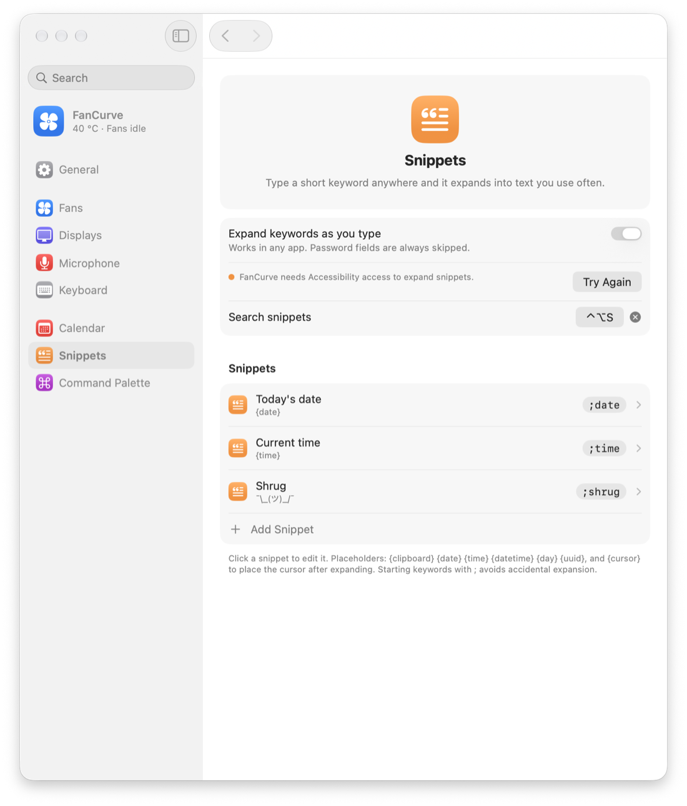
</p>

- **Keyword expansion:** type a keyword such as `;date` in any app and it expands into your saved text.
- **Placeholders:** `{clipboard}` `{date}` `{time}` `{datetime}` `{day}` `{uuid}`, and `{cursor}` for where the cursor lands.
- **Search and paste (⌃⌥S)** into the app you were using.
- **Password fields are never touched.**

### Displays

- **DDC/CI brightness** for external monitors over USB-C, Thunderbolt or DisplayPort, with no extra drivers.
- **Brightness keys** can control the monitor under the pointer, or all displays together. Each press shows a native-style brightness overlay.
- **Match laptop light sensor:** external brightness follows the ambient light around your MacBook. It holds its level while the lid is closed.

### And also

- **Global mic mute (⌃⌥M):** mutes every input device at once, including headsets plugged in while muted. An optional menu bar icon shows when you're muted.
- **Mouse jiggler:** once you've been idle for a while (5 minutes by default), it sweeps the pointer across every monitor at a set interval (every minute by default). This keeps your Mac awake and apps like Teams showing you as active. It stops the moment you're back, and never runs with the lid closed unless you're in clamshell mode.
- **Keyboard cleaning mode:** ignores every key press while the trackpad keeps working. It switches itself off after 5 minutes.
- **Open at login**, plus **in-app updates** from GitHub Releases.

<p align="center">
  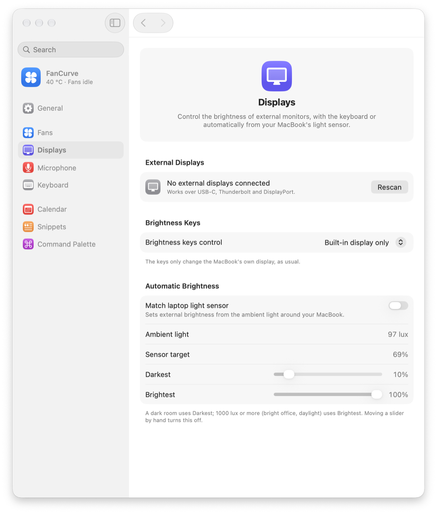
  &nbsp;
  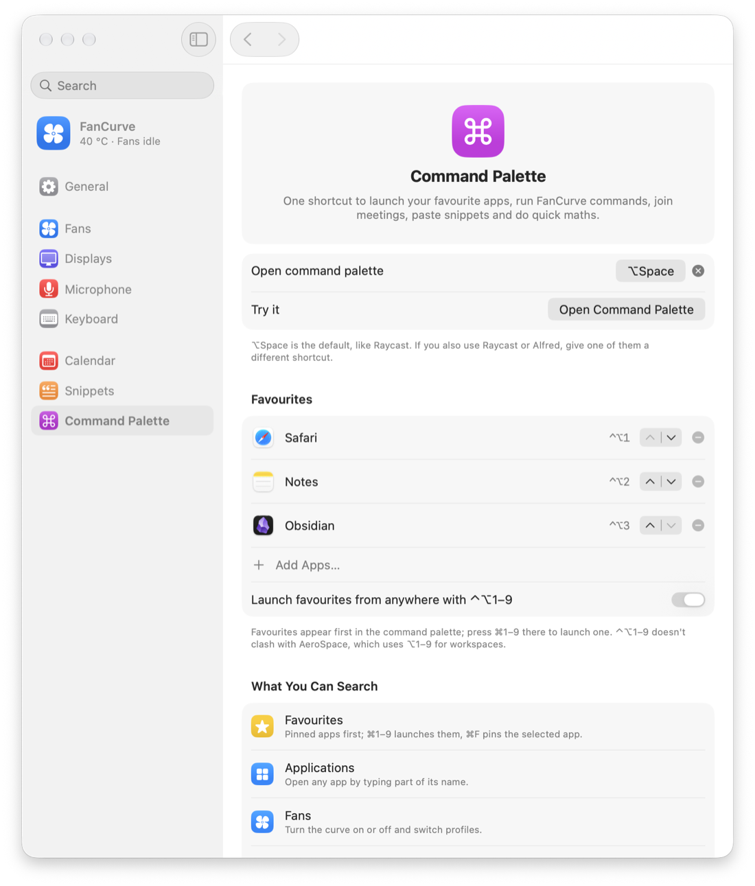
</p>

## Requirements

- **Mac:** Apple Silicon (M1 or later). Developed on an M5 Pro. M1–M4 fan unlocking follows [Stats](https://github.com/exelban/stats).
- **macOS:** 14 Sonoma or later. The current design (glass toolbar, floating sidebar) appears on macOS 26 and later.
- **Fans:** a Mac with fans for fan control, i.e. MacBook Pro, Mac mini, Mac Studio or iMac. On fanless MacBook Airs, everything except the fan curve works.

## Installation

1. Download **FanCurve.zip** from the [latest release](../../releases/latest) and unzip it.
2. The app isn't notarised yet, so clear the download quarantine flag, then run the installer:

   ```bash
   xattr -dr com.apple.quarantine ~/Downloads/FanCurve
   cd ~/Downloads/FanCurve && sudo ./install.sh
   ```

The installer puts **FanCurve.app** in `/Applications` and installs the fan service as a launch daemon (`/Library/PrivilegedHelperTools/fancurved`).

To uninstall everything, and give the fans back to macOS:

```bash
sudo ./uninstall.sh
```

## Permissions

FanCurve only asks for a permission when you turn on a feature that needs it.

| Permission | Used for |
|---|---|
| Administrator password (once, at install or update) | Installing the fan service, which needs root to write fan speeds to the SMC |
| Accessibility | Keyboard cleaning mode, brightness keys, snippet expansion and pasting |
| Calendars | Showing and joining meetings |
| Notifications | Meeting reminders |

FanCurve has no analytics, no telemetry and no network access beyond checking GitHub for updates. All settings stay on your Mac. A GitHub token, if you use one, is stored in your Keychain.

## Keyboard shortcuts

All shortcuts can be changed in Settings. The defaults avoid AeroSpace's default bindings, which all use ⌥ or ⌥⇧ plus a key. FanCurve also warns you if you pick a combination your AeroSpace config already binds.

| Action | Default |
|---|---|
| Command palette | ⌥Space (or ⌘Space, replacing Spotlight: Settings → Command Palette) |
| Launch favourite 1–9 | ⌃⌥1 … ⌃⌥9 |
| Mute / unmute microphone | ⌃⌥M |
| Join next meeting | ⌃⌥J |
| Show schedule | ⌃⌥C |
| Search snippets | ⌃⌥S |
| Quick Notes | ⌃⌥N |
| In the palette: launch a favourite / pin the selected app | ⌘1–9 / ⌘F |

## How it works

```
┌────────────────────────┐   config.json    ┌──────────────────────────┐
│ FanCurve.app           │ ───────────────▶ │ fancurved (root daemon)  │
│ menu bar + Settings UI │                  │ reads temps every 2 s,   │
│ runs as you            │ ◀─────────────── │ writes fan targets (SMC) │
└────────────────────────┘   status.json    └──────────────────────────┘
        /Library/Application Support/FanCurve/
```

- **Two parts:** the app runs as your user and reads the SMC directly. Writing fan speeds needs root, so the curve is applied by `fancurved`, a small launchd daemon. The two talk only through JSON files in `/Library/Application Support/FanCurve/`.
- **Fan control on Apple Silicon:**
  - **M5:** the daemon sets `F0md` (mode) to manual and writes `F0Tg` (target RPM).
  - **M1–M4:** these first need the `Ftst` unlock key. The daemon waits for `thermalmonitord` to release the fans, then does the same.
  - **Handing back:** returning the fans to automatic clears everything again.
- **Temperatures:** `Tp*`, `Te*`, `Ts*` and `Tm*` are CPU clusters, and `Tg*` is the GPU.
- **Displays:** DDC/CI goes through Apple Silicon's `IOAVService` I²C interface, the same approach as [MonitorControl](https://github.com/MonitorControl/MonitorControl) and [m1ddc](https://github.com/waydabber/m1ddc). The light sensor is read through IOHID.

### Command-line tool

```bash
fancurved sensors
sudo fancurved set 4000
sudo fancurved auto
tail -f /var/log/fancurved.log
```

- `fancurved sensors` lists every sensor, the current temperatures and the fan state.
- `sudo fancurved set 4000` holds all fans at 4000 RPM. It's for testing: stop the daemon first, otherwise it overrides this within 2 s.
- `sudo fancurved auto` gives the fans back to macOS.
- `tail -f /var/log/fancurved.log` shows the daemon's log, including every time the fans switch on or off.

## Updating

FanCurve checks this repository's latest GitHub release every few hours. When there's a newer version, **Install Update** appears in the menu, and you approve it with your administrator password. Set this up in **Settings → General → Software Update**. Forks can point it at their own repository; private repositories need a read-only GitHub token.

For Macs on the same network, there's also a local update server: run `./serve.sh on` on the build Mac, and choose *Local network* on the others.

## Building from source

**Requirements:** Xcode 26 or the Command Line Tools for macOS 26 or later. Then:

```bash
git clone https://github.com/GeneralWaffels/FanCurve.git
cd FanCurve
./build.sh
sudo ./install.sh
```

`build.sh` creates `build/FanCurve.app` and `build/fancurved`, stamped with a date-based version.

| Script | Purpose |
|---|---|
| `build.sh` | Release build and app bundle |
| `install.sh` / `uninstall.sh` | Install or remove the app and the fan service |
| `release.sh` | Build and publish a GitHub Release (maintainers) |
| `serve.sh on\|off\|status` | Local-network update server |
| `update.sh` | Command-line updater that uses the local server |

**Screenshots:** the images in this README come from debug-only snapshot mode:

```bash
swift build
.build/debug/FanCurve --snapshot docs/screenshots --shadow --height 900
```

This renders every Settings page in light and dark mode, plus the command palette. See [CONTRIBUTING.md](CONTRIBUTING.md) for the project layout and conventions.

## Safety

FanCurve writes directly to your Mac's System Management Controller. It's designed to fail safe: macOS takes the fans back whenever the curve is off, the daemon stops, or anything goes wrong. The chip's own thermal protection always stays in charge. Still, fan control is inherently low-level, so **use it at your own risk**. FanCurve can't make your Mac run hotter than macOS allows, but a very quiet curve means the chip will slow itself down sooner under load.

## FAQ

<details>
<summary><strong>macOS says FanCurve "can't be opened".</strong></summary>

Release builds are signed ad hoc rather than notarised. Run `xattr -dr com.apple.quarantine` on the unzipped folder, as in [Installation](#installation), or right-click the app and choose **Open**.
</details>

<details>
<summary><strong>Accessibility access keeps resetting after updates.</strong></summary>

macOS ties Accessibility permission to the app's code signature, and ad-hoc signatures change with every build. Remove FanCurve from System Settings → Privacy & Security → Accessibility, then add it again.
</details>

<details>
<summary><strong>My external monitor's brightness doesn't change.</strong></summary>

DDC needs a direct USB-C, Thunderbolt or DisplayPort connection. Some HDMI ports, adapters and docks don't pass it through. Try another cable or port, then click **Rescan** in Settings → Displays.
</details>

<details>
<summary><strong>The fans spin at idle.</strong></summary>

Check the leftmost point of your curve. Any point at or above the fans' minimum speed (about 2300 RPM on MacBook Pros) keeps them running. The Fans page states exactly where your curve starts and stops the fans.
</details>

## Credits

- **[Stats](https://github.com/exelban/stats)** by Serhiy Mytrovtsiy, for the Apple Silicon fan-control sequence (`Ftst` unlock).
- **[MonitorControl](https://github.com/MonitorControl/MonitorControl)** and **[m1ddc](https://github.com/waydabber/m1ddc)**, for DDC on Apple Silicon.
- **[Noctua](https://noctua.at)**, whose published example PWM curves inspired the presets. FanCurve isn't affiliated with Noctua.
- **[AeroSpace](https://github.com/nikitabobko/AeroSpace)** by Nikita Bobko, the tiling window manager FanCurve integrates with.
- **[Raycast](https://raycast.com)**, the inspiration for the command palette.

FanCurve isn't affiliated with or endorsed by Apple.

## License

[MIT](LICENSE) © 2026 Thijs De Clerck
